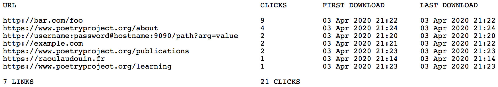

# Links Tracker

Small PHP script to track how many times shared links have been clicked.

## How To

To use the links tracker, copy the folder `links-tracker` anywhere on your server. The folder can be renamed.

To track the link `https://bar.com/foo`, share the link `https://yourdomain.com/links-tracker?url=https://bar.com/foo`. The latter will track every request in a log and redirect to `https://bar.com/foo`. Every new link will automatically be added as a new entry in the log.

The log can be accessed as a plain text spreadsheet (`links-tracker/log.txt`) and as a json array (`links-tracker/log.json`).

To clear the log, go to `https://yourdomain.com/links-tracker?clear`.

The line #30 of `links-tracker/index.php` (`date_default_timezone_set("Europe/Paris");`) can be updated to suit your own time zone.
